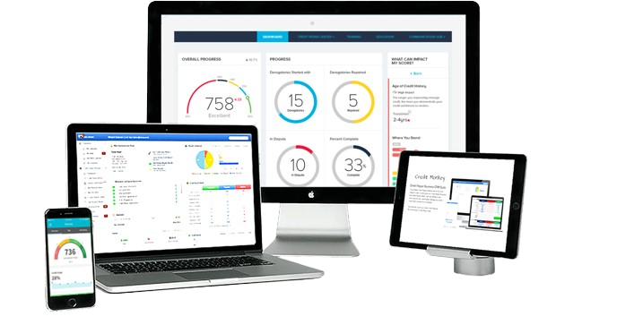

# Image Optimization Guide - Convert PNG to WebP

## Overview
Converting images from PNG to WebP format can reduce file sizes by 25-35% while maintaining quality, resulting in faster page loads.

---

## Current Images

Located in `assets/images/`:
- `logo.png` - Company logo
- `cv-hero.png` - Hero section illustration  
- `cv-investagation.png` - Credit investigation process graphic
- `bbb.png` - Better Business Bureau badge
- `google.png` - Google verification badge
- `yelp.png` - Yelp badge

---

## Option 1: Online Conversion (Easiest)

### CloudConvert
1. Visit https://cloudconvert.com/png-to-webp
2. Upload PNG files
3. Set quality to 85-90%
4. Download WebP files
5. Upload to `assets/images/`

### Squoosh (Google)
1. Visit https://squoosh.app/
2. Drag and drop PNG file
3. Select WebP format
4. Adjust quality slider (85-90%)
5. Download optimized image

---

## Option 2: Command Line (Best for Batch)

### Using cwebp (Official Google Tool)

**Install:**
```bash
# macOS
brew install webp

# Ubuntu/Debian
sudo apt-get install webp

# Windows
# Download from: https://developers.google.com/speed/webp/download
```

**Convert Single File:**
```bash
cwebp -q 85 cv-hero.png -o cv-hero.webp
```

**Batch Convert All PNG Files:**
```bash
cd assets/images
for file in *.png; do
    cwebp -q 85 "$file" -o "${file%.png}.webp"
done
```

**With Optimization:**
```bash
# High quality (larger file)
cwebp -q 90 -m 6 cv-hero.png -o cv-hero.webp

# Balanced (recommended)
cwebp -q 85 -m 4 cv-hero.png -o cv-hero.webp

# Smaller file (good for badges)
cwebp -q 75 -m 6 bbb.png -o bbb.webp
```

---

## Option 3: Using ImageMagick

**Install:**
```bash
# macOS
brew install imagemagick

# Ubuntu/Debian
sudo apt-get install imagemagick
```

**Convert:**
```bash
convert cv-hero.png -quality 85 cv-hero.webp
```

**Batch:**
```bash
mogrify -format webp -quality 85 *.png
```

---

## Option 4: Node.js Script

**Install sharp:**
```bash
npm install sharp
```

**Create conversion script:**
```javascript
// convert-images.js
const sharp = require('sharp');
const fs = require('fs');
const path = require('path');

const inputDir = './assets/images';
const quality = 85;

fs.readdirSync(inputDir)
  .filter(file => file.endsWith('.png'))
  .forEach(async (file) => {
    const inputPath = path.join(inputDir, file);
    const outputPath = path.join(inputDir, file.replace('.png', '.webp'));
    
    await sharp(inputPath)
      .webp({ quality: quality })
      .toFile(outputPath);
    
    console.log(`✅ Converted: ${file} → ${file.replace('.png', '.webp')}`);
  });
```

**Run:**
```bash
node convert-images.js
```

---

## Update HTML to Use WebP

After converting images, update your HTML with fallback support:

### Method 1: Picture Element (Recommended)
```html
<picture>
  <source srcset="assets/images/cv-hero.webp" type="image/webp">
  
</picture>
```

### Method 2: Modernizr Detection
```html
<!-- Add to head -->
<script src="https://cdnjs.cloudflare.com/ajax/libs/modernizr/2.8.3/modernizr.min.js"></script>

<!-- CSS -->
<style>
.webp .hero-image { background-image: url('cv-hero.webp'); }
.no-webp .hero-image { background-image: url('cv-hero.png'); }
</style>
```

---

## Recommended Settings by Image Type

### Logo (logo.png)
- Format: WebP + PNG fallback
- Quality: 90% (needs to be crisp)
- Compression: Lossless if possible
```bash
cwebp -lossless logo.png -o logo.webp
```

### Hero Images (cv-hero.png, cv-investagation.png)
- Format: WebP
- Quality: 85%
- Compression: Lossy
```bash
cwebp -q 85 -m 6 cv-hero.png -o cv-hero.webp
```

### Badges (bbb.png, google.png, yelp.png)
- Format: WebP + PNG fallback
- Quality: 80%
- Compression: Lossy
```bash
cwebp -q 80 bbb.png -o bbb.webp
```

---

## Example HTML Updates

### Current index.html:
```html

```

### Updated with WebP:
```html
<picture>
  <source srcset="assets/images/cv-hero.webp" type="image/webp">
  
</picture>
```

### For Trust Badges:
```html
<!-- Current -->


<!-- With WebP -->
<picture>
  <source srcset="assets/images/bbb.webp" type="image/webp">
  
</picture>
```

---

## Expected Results

| Image | Original Size | WebP Size | Savings |
|-------|--------------|-----------|---------|
| cv-hero.png | ~250 KB | ~175 KB | 30% |
| cv-investagation.png | ~180 KB | ~125 KB | 31% |
| logo.png | ~45 KB | ~32 KB | 29% |
| bbb.png | ~20 KB | ~14 KB | 30% |
| google.png | ~15 KB | ~11 KB | 27% |
| yelp.png | ~18 KB | ~13 KB | 28% |
| **Total** | **~528 KB** | **~370 KB** | **~30%** |

---

## Testing

After conversion:
1. **Visual Check:** Compare side-by-side
2. **File Size:** Confirm reduction
3. **Browser Test:** Test in Chrome, Firefox, Safari
4. **Fallback Test:** Disable WebP support to test PNG fallback
5. **Mobile Test:** Check on actual devices

### Browser Support for WebP:
- ✅ Chrome/Edge: Yes (since 2010/2020)
- ✅ Firefox: Yes (since 2019)
- ✅ Safari: Yes (since 2020)
- ✅ Mobile: Yes (all modern browsers)
- Coverage: ~96% of all browsers

---

## Automation Script

Create `optimize-images.sh`:

```bash
#!/bin/bash

echo "==================================="
echo "Credit Monkey Image Optimization"
echo "==================================="
echo ""

cd assets/images

# Backup originals
mkdir -p originals
cp *.png originals/

# Convert to WebP
echo "Converting images to WebP..."
for file in *.png; do
    if [ "$file" = "logo.png" ]; then
        # Lossless for logo
        cwebp -lossless "$file" -o "${file%.png}.webp"
    elif [[ "$file" == *"badge"* ]] || [[ "$file" == "bbb.png" ]] || [[ "$file" == "google.png" ]] || [[ "$file" == "yelp.png" ]]; then
        # Lower quality for small badges
        cwebp -q 80 "$file" -o "${file%.png}.webp"
    else
        # Standard quality for content images
        cwebp -q 85 -m 6 "$file" -o "${file%.png}.webp"
    fi
    echo "✅ Converted: $file"
done

echo ""
echo "Comparing file sizes..."
echo ""

for file in *.png; do
    webp_file="${file%.png}.webp"
    if [ -f "$webp_file" ]; then
        png_size=$(stat -f%z "$file" 2>/dev/null || stat -c%s "$file")
        webp_size=$(stat -f%z "$webp_file" 2>/dev/null || stat -c%s "$webp_file")
        savings=$(( (png_size - webp_size) * 100 / png_size ))
        echo "$file: $(numfmt --to=iec $png_size) → $webp_file: $(numfmt --to=iec $webp_size) (${savings}% smaller)"
    fi
done

echo ""
echo "==================================="
echo "Optimization Complete!"
echo "==================================="
```

**Make executable and run:**
```bash
chmod +x optimize-images.sh
./optimize-images.sh
```

---

## Next Steps After Conversion

1. ✅ Convert all PNG to WebP
2. ✅ Keep PNG files as fallback
3. ✅ Update HTML with `<picture>` tags
4. ✅ Test in multiple browsers
5. ✅ Monitor page load times
6. ✅ Update documentation

---

## Quick Command Reference

```bash
# Convert single image
cwebp -q 85 input.png -o output.webp

# Batch convert
for f in *.png; do cwebp -q 85 "$f" -o "${f%.png}.webp"; done

# Check quality
cwebp -q 85 -print_psnr input.png -o output.webp

# Create responsive sizes
cwebp -q 85 -resize 800 0 input.png -o output-800.webp
cwebp -q 85 -resize 400 0 input.png -o output-400.webp
```

---

**Status:** Ready to convert! Choose your preferred method and optimize those images! 🚀
